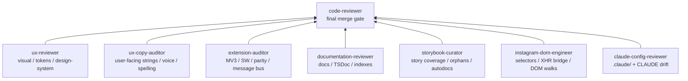

# Agent codeowners

Canonical map of which agent owns which paths in the `igdl` repo, and how reviews compose. The ten agents in `.claude/agents/*.md` carry their own briefs and escalation rules; this file is the bird's-eye view that a contributor (or any agent) can open to answer **"who has to APPROVE a diff to this path?"**

This file is canonical. Per-agent `## Codeownership` sections are local restatements; if the two ever disagree, this file wins. [`claude-config-reviewer`](./claude-config-reviewer.md) audits drift between the two on every change to `.claude/` (see its "Cross-artifact consistency" check).

## What this is not

- **Not a `.github/CODEOWNERS` file.** GitHub doesn't auto-request reviewers from this map. It's the project's agent equivalent.
- **Not the runtime/code ownership of ambient APIs.** "Storage is owned by `src/services/settings/storage.ts`" lives in [`CLAUDE.md`](../../CLAUDE.md) under "Hard rules" and [`docs/code-style-guide.md`](../../docs/code-style-guide.md) under "Single-owner ambient APIs". Those describe which **module** owns a runtime API. This file describes which **agent** approves a diff. Don't conflate them.

## External plugin references

The CLAUDE.md routing table and several agent `Escalation` sections reference plugin-namespaced agents that have no local file in `.claude/agents/`:

- `voltagent-qa-sec:accessibility-tester` — deep WCAG / screen-reader audit.
- `voltagent-qa-sec:security-auditor` — threat modeling, supply-chain audit.
- `voltagent-qa-sec:performance-engineer` — runtime / memory regression review (escalate when content-script polling, XHR interception, or ZIP-blob handling changes).
- `chrome-devtools-mcp:chrome-devtools` — runtime verification in a real browser session.

These are external Claude Code plugins resolved at session-start by the harness. If a plugin isn't installed (or gets renamed), every escalation that points at one silently fails to dispatch. Don't vendor or wrap them locally — keep them as escalation-only references and document the dependency here.

## Agent roster

| Agent | Purpose | Mode | Model |
| --- | --- | --- | --- |
| [`code-reviewer`](./code-reviewer.md) | Five-axis review + igdl invariants. Final merge gate. | review | (default) |
| [`ux-reviewer`](./ux-reviewer.md) | Visual / interaction / design-system parity. | review | (default) |
| [`ux-copy-auditor`](./ux-copy-auditor.md) | User-facing copy accuracy, voice, terminology, American spelling. Severity → Critical / Suggestion bin. | review (read-only) | sonnet |
| [`storybook-curator`](./storybook-curator.md) | Story coverage, orphan pruning, interaction-test floor, autodocs descriptions. | implement + review | sonnet |
| [`documentation-reviewer`](./documentation-reviewer.md) | Docs coverage + TSDoc contract. | review | (default) |
| [`extension-auditor`](./extension-auditor.md) | MV3 manifest, SW lifecycle, Chrome/Firefox parity. | review | (default) |
| [`instagram-dom-engineer`](./instagram-dom-engineer.md) | Selector / parent-walk / XHR-bridge fixes. | implement + review | (default) |
| [`service-implementer`](./service-implementer.md) | Scaffold a new service or component. | implement | (default) |
| [`release-engineer`](./release-engineer.md) | Release scripts, version sync, CI workflow. | implement + review | (default) |
| [`claude-config-reviewer`](./claude-config-reviewer.md) | Audits `.claude/` and `CLAUDE.md` for drift. | review (read-only) | sonnet |

## Path → agent table

| Path | Final approver | Co-owner | Notes |
| --- | --- | --- | --- |
| `src/manifest/**` | `extension-auditor` | `ux-copy-auditor` (`name`, `description`, `action.default_title` user-strings only) | Manifest parity Chrome ↔ Firefox |
| `src/background/**` | `extension-auditor` | — | SW lifecycle, message routing |
| `src/utils/messages.ts` | `extension-auditor` | — | Typed message sender |
| `src/utils/browser.ts` | `extension-auditor` | — | The only `chrome` ↔ `browser` bridge |
| `src/types/messages.ts` | `extension-auditor` | — | Cross-context message discriminated union |
| `src/content/index.ts` | `instagram-dom-engineer` | — | Polling loop, per-route dispatch |
| `src/content/handlers/**` | `instagram-dom-engineer` | — | Per-surface handlers (post, reels, stories, …) |
| `src/content/extractors/**` | `instagram-dom-engineer` | — | API response parsing |
| `src/content/threads/**` | `instagram-dom-engineer` | — | Threads pagelet detection |
| `src/content/selectors.ts` | `instagram-dom-engineer` | — | Centralized SVG path selectors |
| `src/content/button.ts` | `instagram-dom-engineer` | `ux-reviewer` (visual), `ux-copy-auditor` (button `title=` strings) | DOM + click vs visual surface vs button copy; relevant agents must APPROVE on a diff that touches their respective surface |
| `src/content/modals/**` | `ux-reviewer` | `documentation-reviewer` (TSDoc), `ux-copy-auditor` (user-facing strings) | Injected modals (Shadow DOM) |
| `src/content/toasts/**` | `ux-reviewer` | `documentation-reviewer` (TSDoc), `ux-copy-auditor` (user-facing strings) | Injected toasts (Shadow DOM) |
| `src/content/flow/**` | `code-reviewer` | `ux-copy-auditor` (toast templates: success / partial / cancel / failure / single+plural) | Content-script orchestration; user-facing copy is the toast templates |
| `src/content/tokens.ts` | `ux-reviewer` | — | Injected-UI design tokens |
| `src/options/components/cards/**` | `ux-reviewer` | `documentation-reviewer` (TSDoc), `ux-copy-auditor` (user-facing strings) | Options-page cards (Tailwind) |
| `src/options/components/modals/**` | `ux-reviewer` | `documentation-reviewer` (TSDoc), `ux-copy-auditor` (user-facing strings) | Options-page modals (Tailwind) |
| `src/options/components/shared/**` | `ux-reviewer` | `documentation-reviewer` (TSDoc), `ux-copy-auditor` (user-facing strings) | Shared options-page primitives (Card, ConfirmDialog, TextField, Toggle, etc.) |
| `src/index.css` | `ux-reviewer` | — | Options-page tokens + global zero-radius reset |
| `src/stories/DesignSystem.stories.tsx` | `ux-reviewer` | — | Design-system source of truth |
| `src/options/components/**/__stories__/**` | `storybook-curator` | `ux-reviewer` (visual fidelity), `ux-copy-auditor` (story args + rendered copy) | Coverage / orphans / play tests / autodocs description |
| `src/content/{modals,toasts}/**/__stories__/**` | `storybook-curator` | `ux-reviewer` (visual fidelity), `ux-copy-auditor` (story args + rendered copy) | Coverage / orphans / play tests / autodocs description |
| `src/inject.ts` | `instagram-dom-engineer` | — | MAIN-world XHR / fetch interception |
| `src/xhr.ts` | `instagram-dom-engineer` | — | XHR snapshot bridge |
| `src/services/**` | `code-reviewer` | `documentation-reviewer` (TSDoc) | Scaffolded by `service-implementer`; each has a `docs/services/<name>.md` |
| `docs/services/**` | `documentation-reviewer` | — | 1:1 with `src/services/` |
| `docs/architecture.md` (MV3 lifecycle + Storage contract sections) | `extension-auditor` | `documentation-reviewer` (rest of file) | Section-level co-ownership |
| `docs/architecture.md` (everything else) | `documentation-reviewer` | — | |
| `docs/build-and-release.md` (release-flow sections) | `release-engineer` | `documentation-reviewer` (rest) | |
| `docs/build-and-release.md` (everything else) | `documentation-reviewer` | — | |
| `docs/**` (everything else) | `documentation-reviewer` | — | Indexes, code-style, content-script, download-flow, design-system, development, project-readme |
| `README.md` | `documentation-reviewer` (read-only auditor) | — | Voice + scope per [`docs/project-readme.md`](../../docs/project-readme.md). `documentation-reviewer` flags gaps; the main session writes prose. |
| `package.json` (`version` field) | `release-engineer` | — | Synced to both manifests by `scripts/build.mjs` and `scripts/rc-firefox.mjs` |
| `scripts/**` | `release-engineer` | `code-reviewer` (on script refactors) | Build, package, sign, release |
| `.github/workflows/**` | `release-engineer` | — | Only release.yml exists today |
| `web-ext.config.mjs` | `release-engineer` | — | Read by every `web-ext` invocation |
| `.claude/**` | `claude-config-reviewer` (read-only) | — | Audits agents, rules, hooks, settings, skills |
| `CLAUDE.md` | `claude-config-reviewer` (read-only) | — | Audits for path drift, contradictions, stale refs |

### Co-ownership rule

A diff that touches a co-owned path needs **both** agents to APPROVE before `code-reviewer` will merge. Co-ownership comes in two shapes:

**Surface co-ownership** — the two agents own different surfaces of the same file:

- `src/content/button.ts` — `instagram-dom-engineer` owns DOM injection + click delegation; `ux-reviewer` owns the visual surface (fill, border, hover, focus, icon glyph); `ux-copy-auditor` owns the four `title=` strings (button tooltip copy).
- `docs/architecture.md` — `extension-auditor` owns the MV3-lifecycle and Storage-contract sections; `documentation-reviewer` owns the rest of the file.
- `docs/build-and-release.md` — `release-engineer` owns the release-flow sections; `documentation-reviewer` owns the rest.
- `src/manifest/*.manifest.json` — `extension-auditor` owns the JSON structure, permissions, host_permissions, content_scripts, etc.; `ux-copy-auditor` owns the three user-visible string fields (`name`, `description`, `action.default_title`) that render in the browser's extension list / install dialog.

**TSDoc co-ownership** — `documentation-reviewer` is the final approver of TSDoc blocks, while another agent is the final approver of the file's code:

- `src/services/**` — `code-reviewer` owns the service code; `documentation-reviewer` owns the TSDoc on every exported symbol (with `@example`) and the matching `docs/services/<name>.md`.
- `src/content/{modals,toasts}/**` and `src/options/components/{cards,modals}/**` — `ux-reviewer` owns the component code; `documentation-reviewer` owns the TSDoc-style doc block above each `function ComponentName(...)` declaration.

**Story / autodocs co-ownership** — `storybook-curator` is the final approver of `__stories__/<Name>.stories.tsx` and the autodocs `description.component` strings; `ux-reviewer` is co-owner for visual fidelity (token use, mockup parity, theme-variant rendering); `ux-copy-auditor` is co-owner for story-arg copy + the rendered user-visible strings (a `Success` story whose copy reads "Failed to download" is an `ux-copy-auditor` finding, not a `storybook-curator` finding). All three must APPROVE a diff that changes a story's rendered output. The autodocs `description.component` string is curator-owned and does not overlap with the `documentation-reviewer`-owned TSDoc block above the component — they live in different files and both must be present.

**Copy co-ownership** — `ux-copy-auditor` is the final approver of user-visible strings in files whose structural / visual surface another agent owns. Concretely: a diff to `src/options/components/cards/DownloadsCard.tsx` that changes a `description="…"` prop value needs both `ux-reviewer` (the component file's owner) and `ux-copy-auditor` (the string's owner) to APPROVE. The same applies to `src/content/modals/**`, `src/content/toasts/**`, `src/content/flow/**`, `src/options/components/modals/**`, every `*.stories.tsx`, and the three user-visible manifest fields. `ux-copy-auditor` only blocks on Severe + High findings (per its severity model); Medium + Low findings are logged and don't block, so the co-ownership doesn't add merge friction on routine copy diffs.

### Read-only owners

`documentation-reviewer` for `README.md`, `claude-config-reviewer` for `.claude/**` + `CLAUDE.md`, and `ux-copy-auditor` for every user-visible string in its scope are **read-only auditors**. They flag findings and block merge on Critical issues, but they don't write the fix — the file's author or the main session does. (`ux-copy-auditor`'s "Critical" bucket is its Severe + High tiers; its Medium + Low tiers are logged but don't block.)

## Merge-gate hierarchy

`code-reviewer` is the final merge gate for any non-trivial diff. Specialist verdicts feed into it; `code-reviewer` does not approve while any specialist has open Critical findings.



On a non-trivial diff, run the relevant specialists in parallel (single message, multiple tool calls), then `code-reviewer`. On a release-candidate diff, run `code-reviewer` + `ux-reviewer` + `documentation-reviewer` + `extension-auditor` in parallel — a release passes all four (see `extension-auditor.md` "Rules"). When the diff touches UI component code or any `*.stories.tsx`, `storybook-curator` joins that parallel set.

## Hand-off graph

Each arrow means "agent A explicitly recommends escalating to agent B in its `## Escalation` section."

```
code-reviewer            → ux-reviewer, ux-copy-auditor, documentation-reviewer,
                           extension-auditor, instagram-dom-engineer, accessibility-tester,
                           security-auditor, chrome-devtools

ux-reviewer              → code-reviewer, ux-copy-auditor, documentation-reviewer,
                           extension-auditor, storybook-curator, accessibility-tester,
                           chrome-devtools

ux-copy-auditor          → code-reviewer (when copy reveals a real bug),
                           ux-reviewer (visual surface of the string container),
                           documentation-reviewer (TSDoc blocks; README voice),
                           extension-auditor (rest of manifest JSON),
                           storybook-curator (story shape vs copy mismatch),
                           accessibility-tester (a11y attribute strings)

storybook-curator        → ux-reviewer, ux-copy-auditor, documentation-reviewer,
                           code-reviewer, accessibility-tester, chrome-devtools

documentation-reviewer   → code-reviewer, ux-reviewer, extension-auditor

extension-auditor        → code-reviewer, ux-reviewer, documentation-reviewer,
                           security-auditor, chrome-devtools, instagram-dom-engineer

instagram-dom-engineer   → extension-auditor, ux-reviewer, code-reviewer,
                           documentation-reviewer

service-implementer      → code-reviewer, documentation-reviewer (always),
                           ux-reviewer (UI work), storybook-curator (UI work),
                           ux-copy-auditor (UI work — adds new copy),
                           extension-auditor (background-touching)

release-engineer         → extension-auditor, code-reviewer

claude-config-reviewer   → file's original author for fixes; tooling-gap findings
                           feed code-reviewer
```

`service-implementer` and `release-engineer` are the only single-mode "implement" agents on this list; `instagram-dom-engineer` and `storybook-curator` are hybrids that both audit and remediate within their owned surface.

## Concern → agent table

For the concern-keyed summary (which agent handles which kind of work), see [`CLAUDE.md`](../../CLAUDE.md) "Subagent routing". This README owns the path-keyed map above; `CLAUDE.md` owns the concern-keyed one.

## Dev workflow

Before merging any change to `.claude/` or `CLAUDE.md`, run `claude-config-reviewer` to catch path drift, broken cross-references, stale tool fields, and contradictions between this README and the per-agent files. It is read-only — findings come back as Blocking / Suggestion, and the file's author makes the fix.

For ordinary code diffs, the four reviewers compose: on a non-trivial diff, run `code-reviewer`, `ux-reviewer`, `documentation-reviewer`, and `extension-auditor` in parallel. When the diff touches UI component code or any `*.stories.tsx`, add `storybook-curator` to that parallel set. When the diff touches any user-visible string (cards, modals, toasts, the download button, story args, or the three user-visible manifest fields), add `ux-copy-auditor` — its triggers are documented in `.claude/skills/review-all/SKILL.md` Step 3. The hand-off graph above resolves any specialist that needs to fan out further.

**Agent-introduction checklist.** When a new agent acquires co-ownership of paths already owned by existing agents, the same diff that introduces the new agent must also update the `## Codeownership` and `## Escalation` sections of **every** existing agent whose paths are now co-owned. A new co-owner wired only into this README and the skill triggers but not into the existing agents' own files creates a navigation bug: a developer reading only an existing agent's file will not discover the new co-owner. `claude-config-reviewer` audits this in its Cross-artifact consistency check.

For the formal pre-commit review and post-mortem-on-misses rules that govern this workflow, see [`CLAUDE.md`](../../CLAUDE.md) "Review discipline".
