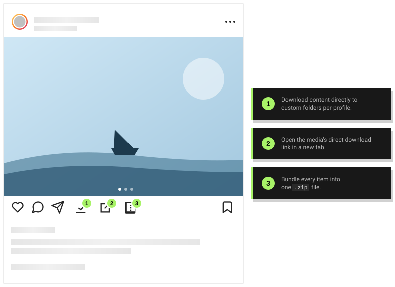

  

# igdl

Chrome and Firefox extension that adds a download button to Instagram and Threads.

  

- **Download** posts, reels, stories, highlights, and carousels.
- Set up **custom download directories** per profile.
- **Customize filenames** with template strings like `{username}-{id}-{datetime}` in the extension's Settings page.

## Install

Grab the [latest release](https://github.com/evolsiri/igdl/releases/latest) and sideload:

- **Chrome** — download `igdl-chrome-<version>.zip` and unzip. Go to `chrome://extensions/` → Developer mode → **Load unpacked**.
- **Firefox** — download `igdl-firefox-<version>.xpi`. Go to `about:addons` → gear ⚙ → **Install Add-on From File…** → pick the `.xpi`. Alternatively, double-click the `.xpi` to open in Firefox.

## Contributing

See [`docs/development.md`](./docs/development.md).

## Credits

This project is a fork of [instagram-download-browser-extension](https://github.com/TheKonka/instagram-download-browser-extension), with added custom per-Instagram profile download directory management.

## License

MIT © [evolsiri](https://github.com/evolsiri).
