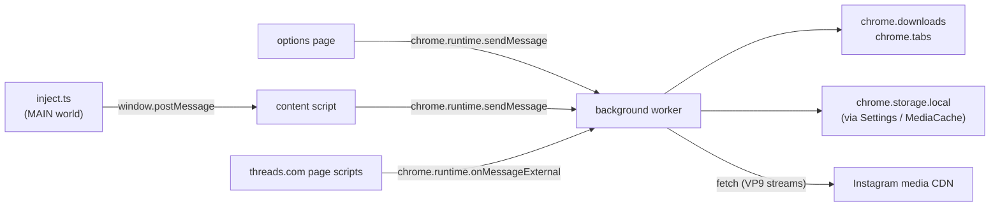

# Architecture

Module boundaries, the message bus, the storage contract, and the MV3 lifecycle differences between Chrome and Firefox. Read this once, then `download-flow.md` to see all the parts in motion at the same time.

## Module map

The four script contexts are isolated:

- **Background worker** (`src/background/chrome.ts` and `src/background/firefox.ts`). Owns every `chrome.downloads.*` call. Holds the canonical `SettingsService` + `MediaCacheService` instances and the `RemuxService`, registers `chrome.runtime.onMessage` and `onStartup` listeners. Chrome ships an ES-module service worker; Firefox ships an IIFE background script — both share `src/background/shared/` for handlers.
- **Content script** (`src/content/index.ts`). Isolated world, runs on `instagram.com` and `threads.com`. Polls the DOM, injects the download button family, runs the per-route handler families in `src/content/handlers/`, and posts cross-context messages.
- **Inject script** (`src/inject.ts`). Runs in the **page's MAIN world** (Chrome via `content_scripts.world: "MAIN"`, Firefox via a `<script>` tag injection from `src/content/loader.ts`). Installs the XHR/fetch monkey-patch from `src/xhr.ts` and forwards captured JSON via `window.postMessage`. No `chrome.*` access — those APIs aren't available in MAIN world.
- **Options page** (`src/options/`). The full Preact app rendered into `options.html`. Reads + writes settings via `SettingsService` directly; uses the same message bus for downloads.

## Services

All under `src/services/<name>/<name>.ts`. Each service is a `createXxxService(options?)` factory returning an interface; state lives in the closure. See `services/<name>.md` for each.

- **SettingsService** — single owner of `chrome.storage.local["igdl_settings"]`. Read, patch, profile-directory CRUD, never-ask CRUD, theme preference, download counters. Subscribes to storage changes so the options page and content script stay in sync.
- **MediaCacheService** — ephemeral cache backed by other `chrome.storage.local` keys. Populated by the XHR-interception layer; cleared on `chrome.runtime.onStartup`. Provides `resolveMediaForPost/Reel/Story/Highlight/Avatar/ThreadsPost` and `getUsernameForPost`.
- **DownloadService** — content-script-side wrapper that sends a `DOWNLOAD_MEDIA` message and surfaces the result. Never throws.
- **ZipService** — main-thread `fflate` wrapper for carousel ZIP downloads. Fetches with `credentials: "omit"` because Instagram's CDN URLs are signed/public and don't return `Access-Control-Allow-Credentials`.
- **RemuxService** — background-side. Fetches a reel's VP9 video stream and its audio stream and stream-copies them into one MP4, for the **Download reels in VP9** setting. No re-encoding, no storage.
- **ThemeService** — toggles a `dark` class on `<html>`. Does **not** persist the preference; the options page feeds it from `SettingsService` and re-applies on settings change.
- **ToastService** — lazy Shadow-DOM toast stack used by the content script. `success` / `failure` / `info`; auto-dismiss after ~4 s.

## Message bus

The discriminated union in `src/types/messages.ts`:

| Variant | Sender | Handler | Returns |
| --- | --- | --- | --- |
| `DOWNLOAD_MEDIA` | content / options | `background/shared/downloads.ts:handleDownloadMedia` | `{ downloadId, usedVp9? }` and bumps profile counters. `usedVp9` is present only when the resource carried a VP9 rendition and the user's `preferVp9Reels` setting is on: `true` if the remuxed VP9 file was downloaded, `false` if the remux failed and the standard video was. |
| `DOWNLOAD_ZIP` | content (carousel button) | `background/shared/downloads.ts:handleDownloadZip` | `{ downloadId }`; the data URL goes to `chrome.downloads.download(saveAs: true)` — as is on Chrome, re-minted as a `blob:` URL on Firefox — with no profile-counter bump |
| `OPEN_URL` | content | `background/shared/open-url.ts:handleOpenUrl` | `null` (opens new tab) |
| `XHR_SNAPSHOT` | content | `background/shared/router.ts` → `mediaCache.ingestXhrSnapshot` | `null` (writes to media cache) |

Senders use the `sendMessage()` wrapper in `src/utils/messages.ts`; never raw `chrome.runtime.sendMessage`. Wrapper guarantees a discriminated `MessageResponse = { ok: true; data } | { ok: false; error; transport? }` and never throws — transport failures (extension reloaded, no receiver, a malformed reply) come back as `{ ok: false, transport: true }`, which is how a sender tells "nobody answered" from an error the handler reported.

The receiver in `background/shared/register.ts:registerSharedBackground` narrows inbound payloads with `asMessage()`, dispatches via `routeMessage()`, and returns `true` from the listener to keep the async channel open. Unknown types come back as `{ ok: false, error: "unknown message type: …" }` rather than throwing.

## Storage contract

One source of truth: `chrome.storage.local`. Three sets of keys, all reached through the `KvStorage` adapter at `src/services/settings/storage.ts`:

| Key family | Owner | Lifetime |
| --- | --- | --- |
| `igdl_settings` (single blob) | `SettingsService` | Persistent. Schema-versioned; future migrations live in `src/services/settings/schema.ts`. |
| Cache keys (`postMedia`, `reelsEdgesData`, `storiesReelsMedia`, `highlightMedia`, `userProfilePicUrl`, `idToUsernameMap`, `threadsPostMedia`) | `MediaCacheService` | Ephemeral. Cleared on `chrome.runtime.onStartup`. |

Direct `chrome.storage.*` access outside those two services is a hard-rule violation — see CLAUDE.md.

## MV3 lifecycle

### Chrome

- **Background**: `service_worker: "background.js"` with `type: "module"`. The worker can be evicted at any time and restarted on the next event; `chrome.ts` keeps module-scope side effects to listener registration only. The one piece of module state in the shared handlers, the queue that runs VP9 builds one at a time (`downloads.ts`), only matters to handlers that are still pending, so losing it to a restart loses nothing.
- **Content script**: two entries in `content_scripts`. `content.js` runs at `document_start` on both Instagram and Threads. `inject.js` runs at `document_start` on Instagram only with `world: "MAIN"`.
- **Threads media**: the inject path doesn't run on Threads. Instead the manifest declares `externally_connectable.matches: ["*://*.threads.com/*"]`, and threads.com page scripts post to the background via `chrome.runtime.onMessageExternal` (`THREADS_MEDIA`). The Threads bridge in `src/background/shared/threads.ts` writes those payloads into the media cache.
- **Options entry**: `options_page: "options.html"`. Toolbar icon click opens it via `chrome.runtime.openOptionsPage()` (registered in `registerSharedBackground`).

### Firefox

- **Background**: `scripts: ["background.js"]` (IIFE — Firefox MV3 doesn't yet load module workers reliably). No `service_worker` key.
- **Content script**: a single entry that loads `content.js` + `loader.js` at `document_idle` (Firefox runs scripts later than Chrome by default). Firefox MV3 has no `world: "MAIN"` support, so `loader.js` (`src/content/loader.ts`) appends a `<script src="inject.js">` tag to the page — the `inject.js` reaches `web_accessible_resources` via `chrome.runtime.getURL`.
- **Permissions**: adds `webRequest` for the Firefox-only XHR-capture stub in `src/background/firefox.ts` (registered listener is currently a no-op pending implementation). No `externally_connectable` — the Threads bridge degrades gracefully on Firefox.
- **Event-page lifetime**: Firefox unloads the background page about 30 seconds after the last extension API call. A message that is still being answered, or a fetch in flight, does **not** extend that. A handler that can run longer — the VP9 remux over a slow connection, any download waiting on a Save As dialog — would be torn down mid-work and its sender told nobody answered. `downloads.ts:keepAlive` therefore makes a trivial API call every 10 seconds for as long as a download handler is pending. Chrome's service worker stays alive for a pending reply by itself (held for five and a half minutes in a Chromium 147 probe), so there the call is unneeded but harmless.
- **Download URLs**: Firefox's `downloads.download` rejects `data:` URLs; Chrome's service worker cannot mint `blob:` URLs. `downloads.ts:mintDownloadUrl` picks per browser by feature-detecting `URL.createObjectURL` — see the URL contract in `services/download.md`. This is also the one place a listener is registered outside module scope: `releaseWhenSettled` adds a `downloads.onChanged` listener to revoke a minted `blob:` URL, and it only needs to live as long as the page that owns the blob.
- **Options entry**: `options_ui.page: "options.html"` with `open_in_tab: true`.
- **Add-on identity**: `browser_specific_settings.gecko.id = "igdl@evolsiri.local"`, `strict_min_version: "115.0"`.

Both manifests live at `src/manifest/{chrome,firefox}.manifest.json`. The build copies the right one and injects the version from `package.json` — see `build-and-release.md`. Don't paste Chrome-only keys into the Firefox manifest: Firefox parses, warns, then **silently refuses to inject content scripts**.

## Content script anatomy

See `content-script.md` for the full picture. In short:

1. **Polling loop**: `processPage()` runs every 3 s, with an early burst every 2 s for the first 10 s to catch late React renders. No `pushState`/`popstate` hooks — polling beats SPA-route races.
2. **Per-route handlers** in `src/content/handlers/` inject the download button next to native action buttons.
3. **Click delegator** at the document level fires `onClickHandler()` for any `.${CLASS_CUSTOM_BUTTON}` click and routes through the **download flow** (`src/content/flow/download.tsx`) — see `download-flow.md`.
4. **Inject world**: `src/inject.ts` runs in the page's main world, monkey-patches `XMLHttpRequest` and `fetch`, posts JSON snapshots back to the isolated content script via `window.postMessage`, which forwards them as `XHR_SNAPSHOT` to the background, which writes them into `MediaCacheService`.
5. **Shadow DOM**: every modal and toast mounts via `createShadowMount()` in `src/content/modals/mount.ts` — open shadow root, inline-token styles, keyboard-shortcut isolation.
